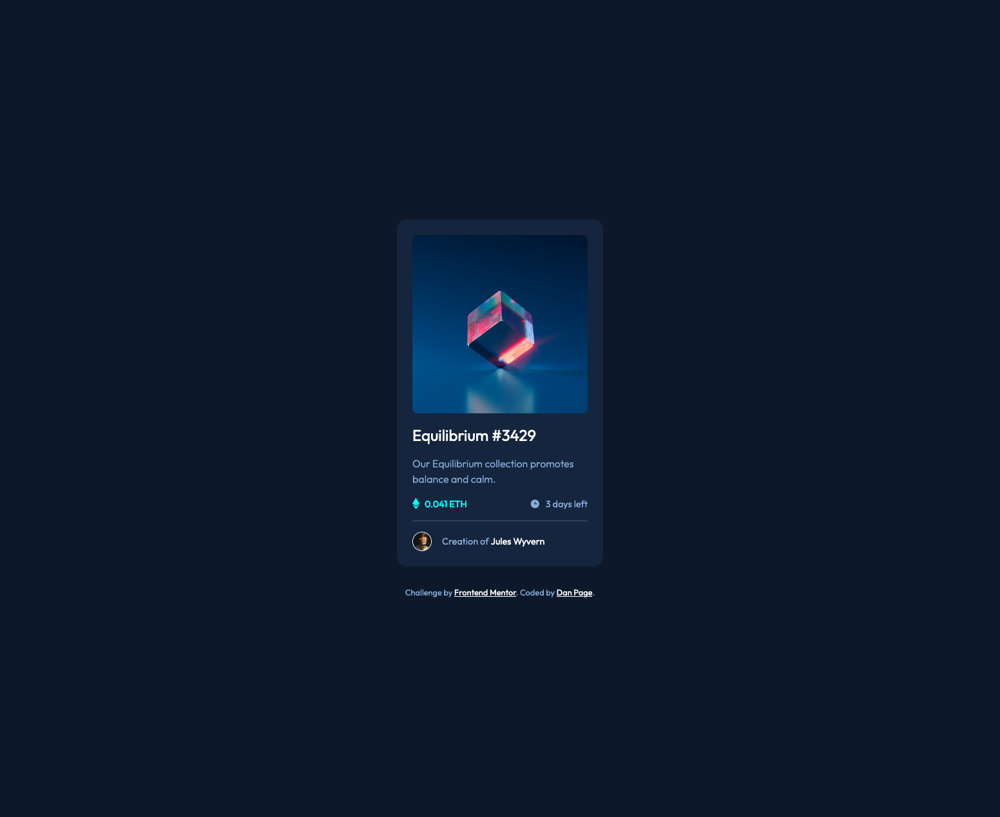

# Frontend Mentor - NFT Preview Card Component

---

## Table of contents

- [Overview](#overview)
  - [The challenge](#the-challenge)
  - [Screenshot](#screenshot)
  - [Links](#links)
- [My process](#my-process)
  - [Built with](#built-with)
  - [Challenages](#what-i-learned)
  - [Continued development](#continued-development)
  - [Useful resources](#useful-resources)
- [Author](#author)
- [Acknowledgments](#acknowledgments)

## Overview
This is a small web component of an NFT preview.

### The challenge

Users should be able to:

- View the NFT component on a mobile and desktop device

### Screenshot

### Links

- Solution URL: [GitHub Repo](https://github.com/dtp27/product-preview-card-component)
- Live Site URL: [NFT Preview Card Component](https://dtp27.github.io/nft-preview-card-component/)

## My process
1. Structured the semantic HTML
2. Wrote the general styles for the page
3. Styled the component top to bottom
4. Tweaked the layout margins/padding/sizing based on the mobile (375px-width) view

### Built with
- Semantic HTML/CSS
- Flexbox + Grid

### Challenges
1. My biggest challenge is understanding how to overlay the view icon on the NFT picture, while centering the view icon as well.

### Useful resources

- [Mozilla Developers Network](https://developer.mozilla.org/en-US/). MDN is always a reliable resource wehen it comes to Front-end Web Development.

## Author

- GitHub - [dtp27](https://github.com/dtp27)
- Frontend Mentor - [@dtp27](https://www.frontendmentor.io/profile/dtp27)

## Acknowledgments

